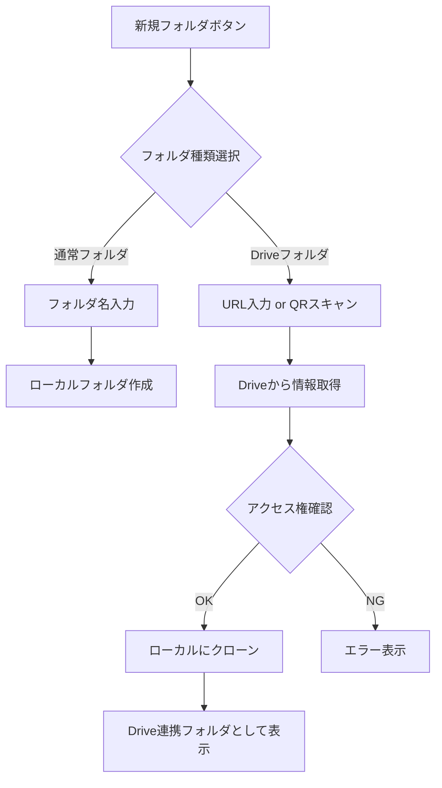
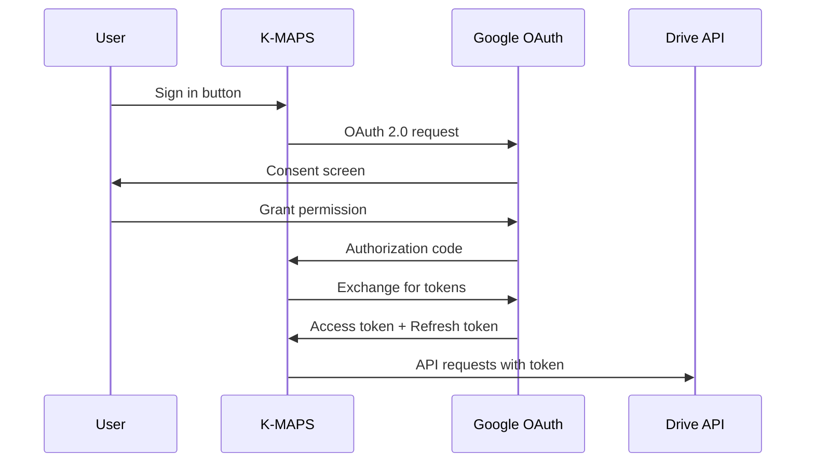
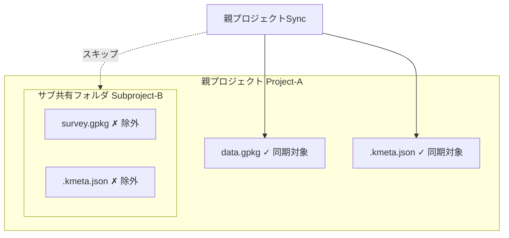
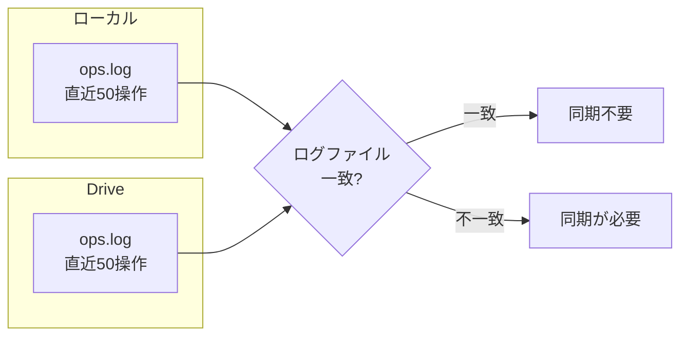
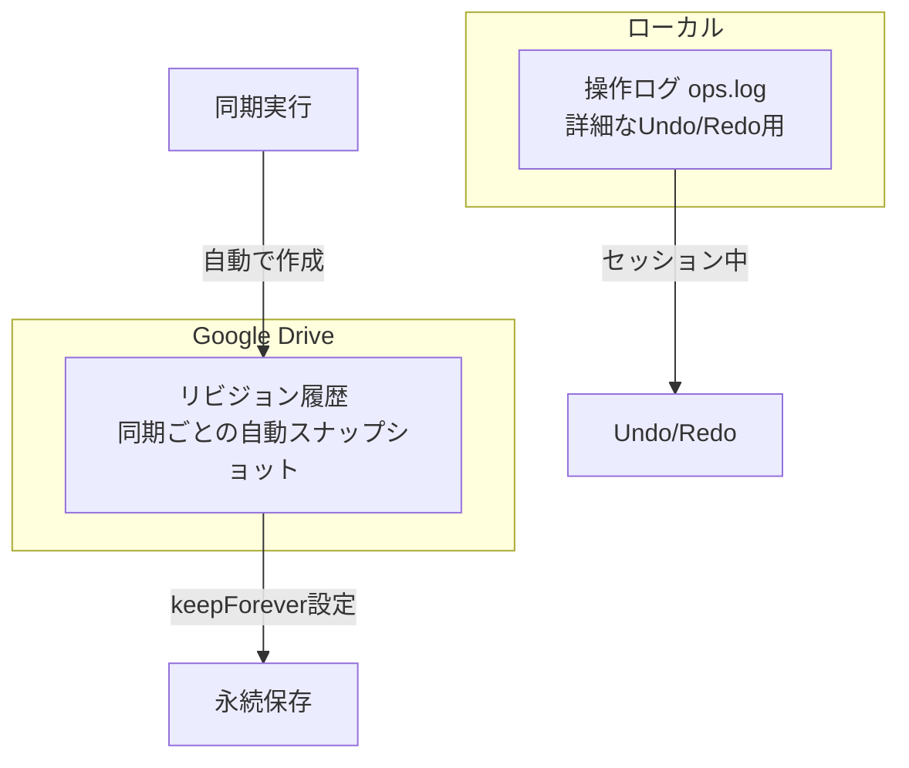
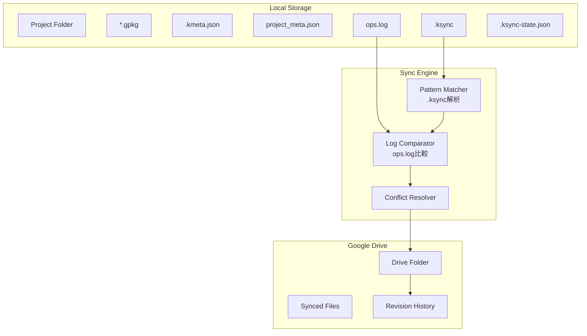
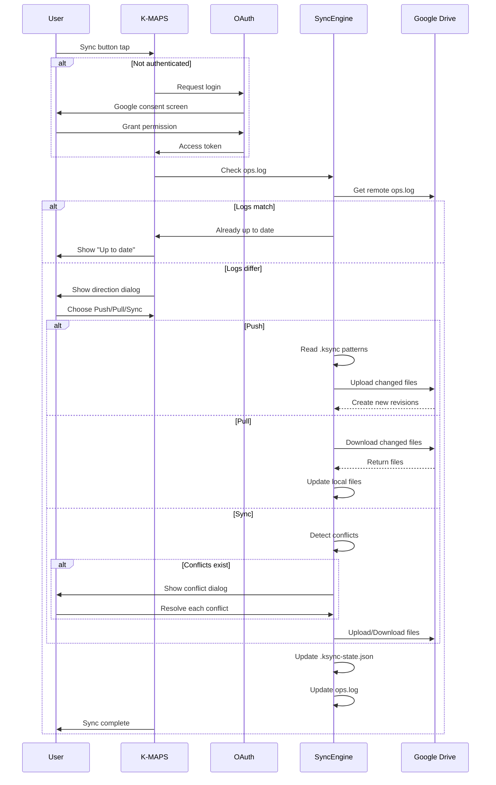
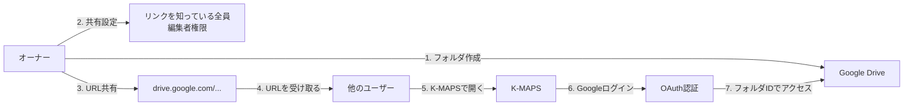

# Google Drive連携

## 概要

K-MAPSのプロジェクトをGoogle Driveと同期し、複数デバイス間でのデータ共有やバックアップを実現する機能。

### 基本方針

- プロジェクトは**ローカルファーストで保存・編集**
- 同期は**手動実行**（ユーザーが明示的に操作）
- 同期方向は**都度選択**（Push / Pull / Sync）
- 複数デバイスからの編集を**想定**（競合解決機能あり）
- **認証必須**（読み込み・書き込み両方でOAuth認証が必要）
- 共有は**URLベース**（フォルダURLを共有するだけで複数ユーザーがアクセス可能）
- **フォルダ単位**での連携（プロジェクト全体ではなく、個別フォルダごとに連携可能）
- **スマホ限定**（PCはGoogle Drive Desktopを使用）

---

## フォルダ単位連携

### 概要

K-MAPSでは、プロジェクト内の任意のフォルダを個別にGoogle Driveと連携できる。
これにより、以下のようなユースケースに対応：

- プロジェクト内で一部のフォルダだけを共有
- 複数の共有フォルダを1つのプロジェクト内に配置
- 他チームが管理するデータを参照用として追加

### Drive連携フォルダの追加フロー



### UIの特徴

- **色違いアイコン**: Drive連携フォルダは青いクラウドアイコンで表示
- **同期状態オーバーレイ**: フォルダアイコンに↑↓マークで同期状態を表示
  - ↑（オレンジ）: ローカルに変更あり（Push可能）
  - ↓（緑）: Driveに変更あり（Pull可能）
  - ⚠（赤）: 競合あり
- **読み取り専用表示**: 編集権限がない場合は読み取り専用バッジを表示

### プラットフォーム制限

| プラットフォーム | Drive連携フォルダ |
|------------------|-------------------|
| Android | ○ 対応 |
| iOS | ○ 対応 |
| Windows | × 非対応（Drive Desktopを使用） |
| macOS | × 非対応（Drive Desktopを使用） |
| Linux | × 非対応 |

PCではGoogle Drive Desktopを使用してフォルダを同期し、K-MAPSからは通常のローカルフォルダとして開く。

**PC版での動作:**
- フォルダ追加時に「Driveフォルダ」オプションは表示されない
- 既存のDrive連携フォルダはアイコンは表示されるが、同期メニューは無効化
- 同期状態の自動チェックもスキップされる
- これはGoogle Drive DesktopとK-MAPSが同時に同期すると競合が発生するため

### QRコード共有

共有URLをQRコード化して、スマホで簡単にスキャンして追加可能。

1. オーナーがDriveで共有設定 → URLを取得
2. URLをQRコード化（任意のQRコード生成サービス使用）
3. 他ユーザーがK-MAPSでQRスキャン → 自動でクローン

### コスト

| 項目 | コスト |
|------|--------|
| Google Drive API | **無料** |
| OAuth認証 | **無料** |
| デフォルトクォータ | 10億リクエスト/日 |
| ユーザーごと制限 | 1,000リクエスト/100秒 |

※ クォータ超過時は課金なし（403エラーが返るのみ）。ユーザーのDriveストレージ超過時のみ別途料金が発生。

---

## 認証・API設計

### OAuth 2.0フロー



### 必要なスコープ

| スコープ | 用途 |
|---------|------|
| `https://www.googleapis.com/auth/drive` | Driveファイルへの読み書きアクセス |
| `https://www.googleapis.com/auth/userinfo.email` | ユーザー識別用 |

※ `drive`スコープを使用することで、他ユーザーが共有したフォルダにもURLだけでアクセス可能。Google PlayユーザーはGoogleアカウントを持っているため、認証必須でも問題なし。

### トークン管理

- **アクセストークン**: 短期間（1時間）有効、API呼び出しに使用
- **リフレッシュトークン**: 長期間有効、セキュアストレージに保存
- アクセストークン期限切れ時は自動でリフレッシュ
- リフレッシュ失敗時は再ログインを促す

### 認証状態の永続化

```
project_meta.json
├── auth (ローカル専用、同期対象外)
│   ├── userId: "user@gmail.com"
│   └── tokenStorage: (secure storage reference)
```

---

## 同期対象の定義

### .ksyncファイル

プロジェクトルートに配置する同期パターン定義ファイル。`.gitignore`形式で記述。

```
# .ksync - 同期対象の定義

# デフォルトで同期するファイル
*.gpkg
*.kmeta.json
project_meta.json

# 除外パターン（先頭に!をつけない行は除外）
# ローカル専用ファイル
.ksync-state.json
*.tmp
*.backup

# 大きなキャッシュファイル
tile_cache/
```

### デフォルトの同期対象

| ファイル/パターン | 同期 | 備考 |
|------------------|------|------|
| `*.gpkg` | ○ | GeoPackageファイル |
| `.kmeta.json` | ○ | フォルダメタデータ |
| `project_meta.json` | △ | Drive連携情報を除いた部分のみ |
| `.ksync` | ○ | 同期パターン定義自体 |
| `.ksync-state.json` | × | ローカル専用（同期状態） |
| `ops.log` | ○ | 操作ログ（差分検出用） |

### メタデータの扱い

`project_meta.json`内の一部フィールドはローカル専用として同期対象外とする：

```json
{
  "name": "My Project",
  "created": "2025-01-01T00:00:00Z",
  "drive": {
    "folderId": "xxx",
    "lastSync": "2025-01-15T12:00:00Z"
  },
  "_local": {
    "auth": { ... },
    "deviceId": "device-xxx"
  }
}
```

`_local`プレフィックスのフィールドは同期時に除外。

### ネストされた共有フォルダの扱い

プロジェクトフォルダ内に別の共有フォルダ（サブプロジェクト）が存在する場合の処理。

#### 基本方針

- **サブ共有フォルダは自動的に同期対象から除外**
- 同期完了後にサブ共有フォルダの存在をユーザーに通知
- ユーザーが希望すれば個別に同期可能

#### 問題の回避



これにより以下を回避：
- 親Sync時にサブプロジェクトが意図せず上書きされる
- 権限の異なるフォルダへの誤った書き込み
- 複数オーナー間の競合

#### 同期完了時の通知

```
┌─────────────────────────────────────────┐
│  Sync Complete                          │
├─────────────────────────────────────────┤
│  ✓ 5 files synced                       │
│                                         │
│  ℹ️ Found shared subfolders:            │
│    • Subproject-B (owner: user-b@...)   │
│    • Survey-2024 (owner: user-c@...)    │
│                                         │
│  [Sync These Too]  [Ignore]             │
└─────────────────────────────────────────┘
```

#### サブ共有フォルダの検出

同期エンジンは以下の条件でサブ共有フォルダを検出：

1. フォルダに独自の共有設定がある（親と異なるpermissions）
2. フォルダ内に`project_meta.json`が存在する
3. `.ksync-state.json`に別のDrive連携情報がある

#### .ksync-state.jsonへの記録

```json
{
  "version": 1,
  "lastSync": { ... },
  "files": { ... },
  "excludedSharedFolders": [
    {
      "name": "Subproject-B",
      "folderId": "1abc...xyz",
      "owner": "user-b@gmail.com",
      "detectedAt": "2025-01-15T12:00:00Z"
    }
  ]
}
```

---

## 同期メカニズム

### 同期方向の選択

ユーザーが同期実行時に選択：

| 方向 | 説明 |
|------|------|
| **Push** | ローカル → Drive（ローカルの変更をアップロード） |
| **Pull** | Drive → ローカル（Driveの変更をダウンロード） |
| **Sync** | 双方向同期（差分を検出し、競合があれば解決） |

### 差分検出方法

操作ログファイル（`ops.log`）の比較による軽量な差分検出：



**メリット：**
- GeoPackage全体（数MB〜GB）のハッシュ計算が不要
- ログファイル（数KB）の比較だけで判定可能
- Undo/Redo機能と操作ログを共用

### ops.logの構造

```json
{
  "version": 1,
  "deviceId": "device-xxx",
  "logs": [
    { "id": 1, "ts": "2025-01-15T10:00:00Z", "op": "addFeature", "target": "layer1" },
    { "id": 2, "ts": "2025-01-15T10:05:00Z", "op": "updateGeometry", "target": "layer1" }
  ]
}
```

- 直近50操作のみ保持（古いものは自動削除）
- 50操作が完全一致することはまずありえないため、実質的なチェックサムとして機能

### 同期状態の管理

`.ksync-state.json`（ローカル専用）：

```json
{
  "lastSyncTime": "2025-01-15T12:00:00Z",
  "lastSyncLogId": 42,
  "driveRevisionId": "rev-xxx",
  "syncedFiles": {
    "data.gpkg": { "localHash": "abc123", "driveRevision": "rev-001" },
    "points.gpkg": { "localHash": "def456", "driveRevision": "rev-002" }
  }
}
```

---

## 競合解決

### 競合の検出条件

Sync（双方向）実行時に、以下の条件で競合を検出：

1. ローカルに未同期の変更がある（ops.logに差分）
2. かつ、Driveにも新しいリビジョンがある

### 競合解決のオプション

| オプション | 説明 |
|-----------|------|
| **Keep Local** | ローカル版を採用し、Driveを上書き |
| **Keep Remote** | Drive版を採用し、ローカルを上書き |
| **Keep Both** | 両方を別ファイルとして保持（リネーム） |

### GeoPackageファイルの競合

GeoPackageはバイナリファイルのため、内容のマージは不可能。ファイル単位での選択が必要：

```
競合検出: data.gpkg
├── ローカル版: 2025-01-15 10:00 (3 features added)
├── Drive版:   2025-01-15 09:30 (2 features deleted)
└── 選択: [Keep Local] [Keep Remote] [Keep Both]
```

「Keep Both」選択時は `data_conflict_20250115.gpkg` のようにリネームして両方を保持。

---

## バージョン履歴

### ハイブリッド方式



### Google Drive リビジョン機能

Drive APIを使用してリビジョンを管理：

| API | 用途 |
|-----|------|
| `revisions.list` | ファイルのリビジョン一覧取得 |
| `revisions.get` | 特定リビジョンのダウンロード |
| `revisions.update` | `keepForever`設定の変更 |
| `revisions.delete` | 不要なリビジョンの削除 |

### リビジョン保持ポリシー

- **デフォルト**: 30日後または100個超過で自動削除
- **重要な同期時**: `keepForever: true`を設定して永続化
- ユーザーが「このバージョンを保持」と明示的に選択可能

---

## UI/UX設計

### プロジェクトを開くメニュー

```
┌─────────────────────────────────┐
│  Open Project                   │
├─────────────────────────────────┤
│  [📁 Local]     Open from local │
│  [🔗 URL]       Open from URL   │  ← 共有URLを貼り付け
│  [☁️ Drive]     Open from Drive │  ← Picker UIで選択
└─────────────────────────────────┘
```

### 同期ボタンと状態インジケータ

```
┌─────────────────────────────────┐
│  [🔄 Sync]  ● Up to date        │  ← 同期済み
│  [🔄 Sync]  ● Changes pending   │  ← ローカルに変更あり
│  [🔄 Sync]  ● Updates available │  ← Driveに更新あり
│  [🔄 Sync]  ⚠ Conflict          │  ← 競合あり
│  [🔄 Sync]  ○ Not connected     │  ← 未連携
│  [🔄 Sync]  🔒 Login required   │  ← 要ログイン
└─────────────────────────────────┘
```

### 同期方向選択ダイアログ

```
┌─────────────────────────────────┐
│  Sync Direction                 │
├─────────────────────────────────┤
│  [↑ Push]   Upload local        │
│             changes to Drive    │
├─────────────────────────────────┤
│  [↓ Pull]   Download Drive      │
│             changes to local    │
├─────────────────────────────────┤
│  [⇅ Sync]   Two-way sync        │
│             (may need conflict  │
│              resolution)        │
└─────────────────────────────────┘
```

### 競合解決ダイアログ

```
┌─────────────────────────────────┐
│  Conflict: data.gpkg            │
├─────────────────────────────────┤
│  Local:  Jan 15, 10:00          │
│          +3 features            │
│                                 │
│  Drive:  Jan 15, 09:30          │
│          -2 features            │
├─────────────────────────────────┤
│  [Keep Local] [Keep Remote]     │
│  [Keep Both]                    │
└─────────────────────────────────┘
```

### 進捗表示

```
┌─────────────────────────────────┐
│  Syncing...                     │
│  ████████░░░░░░░░░░░░  40%      │
│                                 │
│  Uploading: data.gpkg (2/5)     │
└─────────────────────────────────┘
```

---

## エラー・オフライン対応

### ネットワークエラー

| 状況 | 動作 |
|------|------|
| 同期中に接続断 | 中断し、部分的な変更をロールバック |
| 接続復帰時 | 通知を表示し、再同期を促す |
| タイムアウト | リトライ（最大3回）後にエラー表示 |

### 認証エラー

| 状況 | 動作 |
|------|------|
| アクセストークン期限切れ | リフレッシュトークンで自動更新 |
| リフレッシュトークン失効 | 再ログインダイアログを表示 |
| 権限取り消し | 再認証を促す通知 |

### オフライン時の動作

- 同期ボタンは無効化（グレーアウト）
- ローカル編集は通常通り可能
- 接続復帰時に「同期が必要」インジケータを表示

---

## データ構造

### project_meta.json

```json
{
  "name": "My Survey Project",
  "created": "2025-01-01T00:00:00Z",
  "modified": "2025-01-15T12:00:00Z",
  
  "drive": {
    "folderId": "1abc...xyz",
    "folderName": "K-MAPS Projects/My Survey",
    "lastSync": "2025-01-15T12:00:00Z",
    "autoSync": false
  },
  
  "_local": {
    "deviceId": "device-xxx-yyy",
    "authRef": "secure-storage-key"
  }
}
```

### .ksync

```gitignore
# 同期対象（include）
*.gpkg
*.kmeta.json
project_meta.json
ops.log

# 除外（exclude）
.ksync-state.json
*.tmp
*.backup
tile_cache/
thumbnails/
```

### .ksync-state.json

```json
{
  "version": 1,
  "lastSync": {
    "time": "2025-01-15T12:00:00Z",
    "direction": "sync",
    "deviceId": "device-xxx"
  },
  "files": {
    "data.gpkg": {
      "localModified": "2025-01-15T10:00:00Z",
      "driveRevisionId": "rev-abc123",
      "syncedAt": "2025-01-15T12:00:00Z"
    }
  },
  "pendingChanges": []
}
```

### ops.log

```json
{
  "version": 1,
  "deviceId": "device-xxx",
  "maxEntries": 50,
  "logs": [
    {
      "id": 48,
      "ts": "2025-01-15T09:55:00Z",
      "op": "addFeature",
      "file": "data.gpkg",
      "layer": "points"
    },
    {
      "id": 49,
      "ts": "2025-01-15T10:00:00Z",
      "op": "updateGeometry",
      "file": "data.gpkg",
      "layer": "lines"
    },
    {
      "id": 50,
      "ts": "2025-01-15T10:05:00Z",
      "op": "deleteFeature",
      "file": "data.gpkg",
      "layer": "points"
    }
  ]
}
```

---

## アーキテクチャ



---

## 同期フロー



---

## URL共有

### 仕組み

フォルダ単位でURLを共有することで、複数ユーザーがプロジェクトにアクセス可能。



### 共有URLの形式

```
https://drive.google.com/drive/folders/{folderId}?usp=sharing
```

K-MAPSはURLからフォルダIDを抽出し、Drive APIでアクセス。

### 共有設定（オーナー側）

1. Google Driveでプロジェクトフォルダを右クリック → 「共有」
2. 「一般的なアクセス」→「リンクを知っている全員」
3. 権限 →「編集者」
4. URLをコピーして共有

### アクセス（共有された側）

1. K-MAPSで「Open from URL」
2. 共有URLを貼り付け
3. Googleアカウントでログイン（初回のみ）
4. プロジェクトがローカルにPull（クローン）される

### セキュリティ上の注意

- 「リンクを知っている全員」設定はURLが漏洩するとアクセスされるリスクあり
- 機密性の高いプロジェクトは「制限付き」設定で特定ユーザーのみに共有を推奨

---

## プロジェクト連携フロー

### 新規プロジェクト作成

#### ローカルで作成 → Driveに連携

1. ローカルでプロジェクト作成
2. 「Connect to Drive」を選択
3. Driveフォルダを選択または新規作成
4. 初回Push実行
5. 共有したい場合はDriveで共有設定

#### URLから作成（共有されたプロジェクト）

1. 「Open from URL」を選択
2. 共有URLを貼り付け
3. Googleログイン（未認証の場合）
4. ローカルにPull（クローン）
5. 連携情報を`project_meta.json`に保存

#### Driveから作成（自分のDriveから）

1. 「Open from Drive」を選択
2. 既存のDriveフォルダを選択
3. ローカルにPull（クローン）
4. 連携情報を`project_meta.json`に保存

### 既存プロジェクトを開く

1. ローカルプロジェクトフォルダを選択
2. `project_meta.json`からDrive連携情報を読み込み
3. 同期状態を確認し、インジケータを更新

---

## 関連ドキュメント

- [[project-management]] - プロジェクトとGeoPackage管理
- [[layer-management]] - レイヤー管理機能
